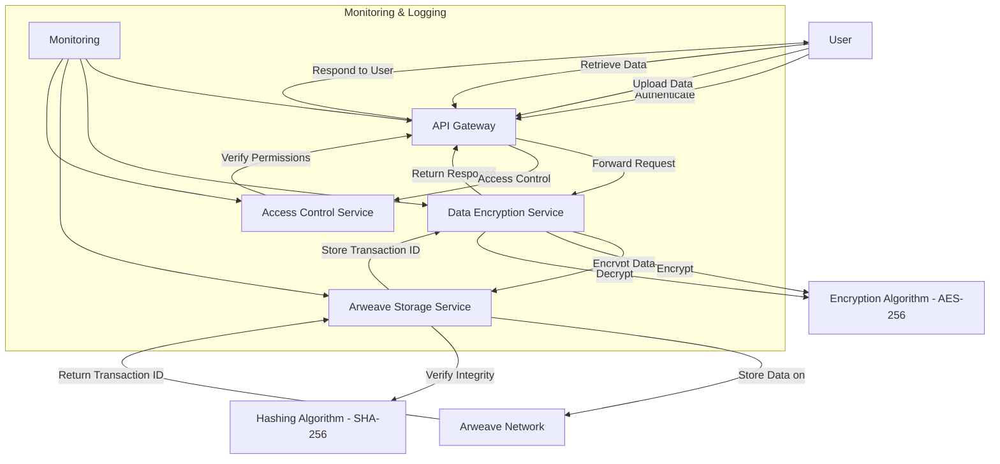

### Cybersleuth Decentralized Storage System Architecture

#### Overview
This document outlines the architecture for the decentralized storage component of Cybersleuth using Arweave. It details how the blockchain part will interface with the rest of the system to ensure secure and efficient data storage and retrieval.

### Architecture Components

1. **Frontend Interface**
    - **User Authentication**
    - **Data Upload**
    - **Data Retrieval**
    - **User Management**

2. **Backend Services**
    - **API Gateway**
    - **Data Encryption Service**
    - **Arweave Storage Service**
    - **Access Control Service**
    - **Monitoring and Logging**

3. **Blockchain Integration**
    - **Arweave Node**
    - **Smart Contracts (if applicable)**

### 1. Frontend Interface

#### 1.1 User Authentication
- Users authenticate via Multi-Factor Authentication (MFA).
- User credentials and authentication tokens are managed securely.
- Integrates with the Access Control Service.

#### 1.2 Data Upload
- Users upload data via a web interface.
- Data is encrypted client-side before being sent to the backend.
- The encrypted data is then sent to the Data Encryption Service.

#### 1.3 Data Retrieval
- Users request data through the web interface.
- The request is authenticated and authorized.
- The encrypted data is fetched from Arweave, decrypted client-side, and displayed to the user.

#### 1.4 User Management
- Admin interface for managing user roles and permissions.
- Integrates with the Access Control Service.

### 2. Backend Services

#### 2.1 API Gateway
- Central entry point for all client requests.
- Routes requests to appropriate backend services.
- Handles load balancing and rate limiting.

#### 2.2 Data Encryption Service
- Encrypts data using AES-256 before storage.
- Manages encryption keys securely.
- Decrypts data retrieved from Arweave.

#### 2.3 Arweave Storage Service
- Interacts with Arweave to store and retrieve encrypted data.
- Ensures data integrity using hashing algorithms (SHA-256).
- Provides transaction IDs for stored data.

#### 2.4 Access Control Service
- Manages user roles and permissions using RBAC.
- Integrates with User Authentication to enforce access controls.
- Logs access and actions for auditing purposes.

#### 2.5 Monitoring and Logging
- Monitors system health and performance.
- Logs all transactions and actions for auditing and debugging.

### 3. Blockchain Integration

#### 3.1 Arweave Node
- A dedicated node to interact with the Arweave network.
- Manages transactions for storing and retrieving data.
- Ensures data is distributed and replicated across the network.

#### 3.2 Smart Contracts (if applicable)
- Custom smart contracts to manage specific data storage rules and access policies.
- Automates compliance with regulatory requirements.

### Data Flow Diagram

### Detailed Component Interactions

#### User Authentication
- **Flow**: User -> API Gateway -> Access Control Service
- **Description**: Authenticates users using MFA. Validates user credentials and issues authentication tokens.

#### Data Upload
- **Flow**: User -> API Gateway -> Data Encryption Service -> Arweave Storage Service -> Arweave Network
- **Description**: Encrypts data client-side, then again on the server, stores it on Arweave, and returns a transaction ID.

#### Data Retrieval
- **Flow**: User -> API Gateway -> Arweave Storage Service -> Arweave Network -> Data Encryption Service -> User
- **Description**: Retrieves encrypted data from Arweave, decrypts it on the server, and then again on the client-side for the user.

#### Access Control
- **Flow**: API Gateway -> Access Control Service
- **Description**: Ensures only authorized users can access or modify data based on predefined roles and permissions.

#### Monitoring and Logging
- **Flow**: All components -> Monitoring and Logging Service
- **Description**: Tracks system health, logs transactions, and user actions for auditing and debugging.

### Deployment Considerations

#### Infrastructure
- **Cloud Provider**: AWS, Azure, or GCP for scalable infrastructure.
- **Arweave Node**: Ensure high availability and redundancy.

#### Security
- **Encryption**: Ensure encryption at rest and in transit.
- **Authentication**: Implement MFA and secure token management.
- **Access Control**: Regular audits and updates to user permissions.

#### Performance
- **Load Balancing**: Use a load balancer to distribute traffic.
- **Caching**: Implement caching strategies for frequently accessed data.

#### Compliance
- **Data Protection Laws**: Ensure compliance with GDPR, HIPAA, etc.
- **Audit Logs**: Maintain detailed logs for auditing purposes.

### Conclusion
This architecture provides a detailed blueprint for integrating Arweave as a decentralized storage solution within the Cybersleuth platform. It ensures data security, integrity, and scalability, while seamlessly interfacing with the broader system components. By following this design, the development team can build a robust and efficient decentralized storage system.